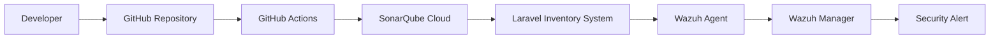

<div align="center">

# 🛡️ DevSecOps Pipeline for Inventory System Integrity Assurance

### Analysis of DevSecOps Pipeline Implementation Using Version Control, SAST, and File Integrity Monitoring for Inventory System Integrity Validation Based on SRE Principles

[](https://laravel.com)


</div>

---

## 📌 Project Overview

This repository contains the implementation of a DevSecOps security pipeline developed as part of an undergraduate thesis project.

The research focuses on validating and maintaining the integrity of an inventory management system by integrating:

* GitHub Version Control
* GitHub Actions CI/CD
* SonarQube Cloud SAST
* Wazuh File Integrity Monitoring
* Security Alerting Mechanism
* Site Reliability Engineering (SRE)

The target application is an inventory warehouse management system called **KAICek**.

---

## 🏗️ Security Pipeline Architecture



---

## 🔒 Security Controls

| Component       | Purpose                             |
| --------------- | ----------------------------------- |
| GitHub          | Version Integrity                   |
| GitHub Actions  | Automated Security Pipeline         |
| SonarQube Cloud | Static Application Security Testing |
| Wazuh Agent     | Real-Time File Monitoring           |
| Wazuh Manager   | Security Event Correlation          |
| Alert System    | Incident Notification               |
| SRE             | Reliability Validation              |

---

## 🚀 Features

### Version Integrity Validation

* Commit Tracking
* Source Code Audit Trail
* Change History Validation

### Static Application Security Testing

* SQL Injection Detection
* Security Hotspot Analysis
* Vulnerability Detection
* Code Smell Detection
* Quality Gate Validation

### File Integrity Monitoring

* Real-Time Monitoring
* File Modification Detection
* Unauthorized Change Detection
* Integrity Validation

### Alerting System

* Dashboard Monitoring
* Email Notification
* Security Event Reporting

---

## ⚙️ Technology Stack

```text
Backend       : Laravel 12
Language      : PHP 8.x
Database      : MySQL
Versioning    : Git & GitHub
CI/CD         : GitHub Actions
SAST          : SonarQube Cloud
FIM           : Wazuh
OS            : Ubuntu Server
Methodology   : Site Reliability Engineering (SRE)
```

---

## 📂 Repository Structure

```text
TA-KAI-checklist/
│
├── app/
├── bootstrap/
├── config/
├── database/
├── public/
├── resources/
├── routes/
├── storage/
├── tests/
│
├── .github/
│   └── workflows/
│       └── sonarcloud.yml
│
└── README.md
```

---

## 🎯 Research Objectives

This study aims to evaluate the effectiveness of integrating:

* Version Control
* Static Application Security Testing (SAST)
* File Integrity Monitoring (FIM)

into a DevSecOps pipeline to improve inventory system integrity and security assurance.

---

## 📚 Research Outputs

### Undergraduate Thesis

Implementation and evaluation of a DevSecOps pipeline for inventory system integrity assurance.

### Scientific Publication

Research paper discussing security validation through SAST and FIM integration.

### Thesis Book

Comprehensive documentation of methodology, implementation, experimentation, and evaluation.

---

## 👨‍💻 Author

**Dhimas Faza Wicaksana**

Information Systems

Telkom University, 2026

Research Area:
DevSecOps • Application Security • SRE • Cyber Security • Software Quality

---

⭐ If this repository helps your research, consider giving it a star.
